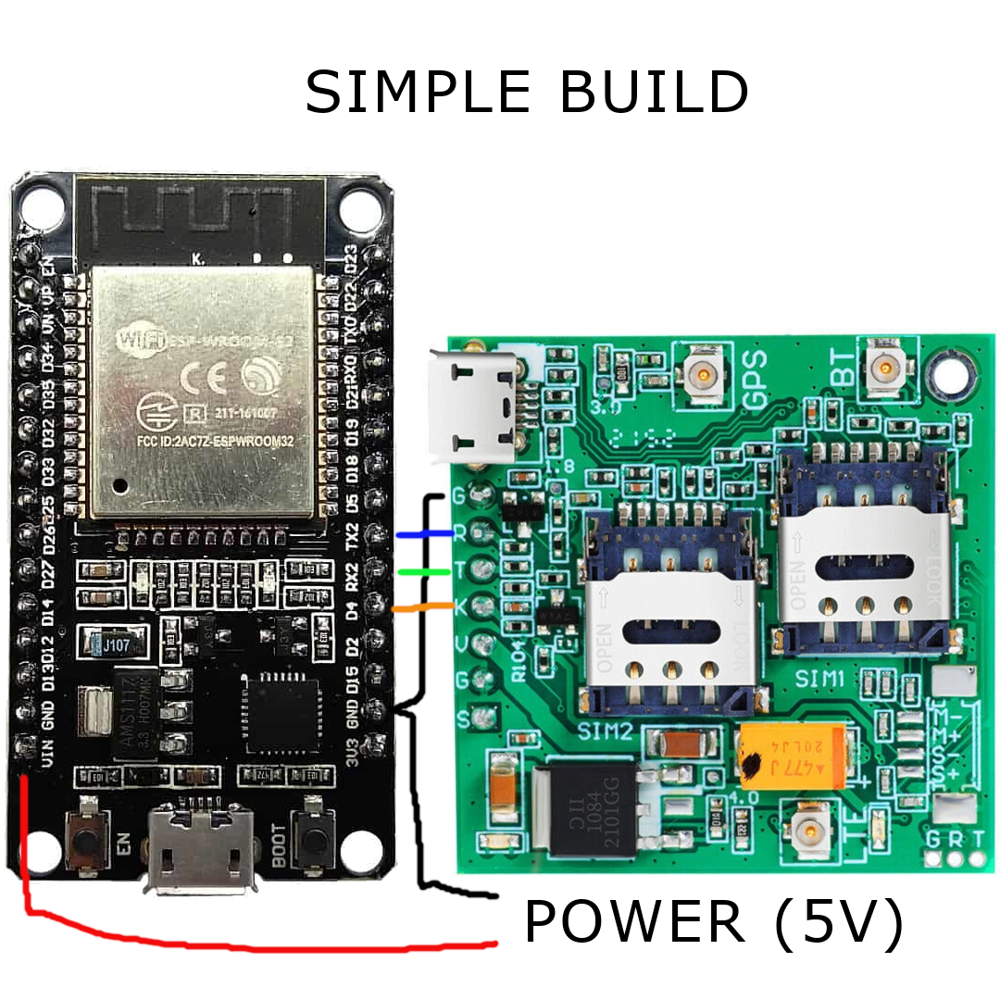

# TETHER 📱🤖

*"Using AI as your overkill, but hilarious SMS assistant."*

---

## 🎬 As Seen In

This project appeared in my YouTube video:
[](https://www.youtube.com/watch?v=HhgXPrvGvfA)

And yes, it’s also on Instructables - COMING SOON

---

## ⚠️ What Is This?

Ever wondered what it’s like to interrogate ChatGPT from your **ancient flip phone**?
Me neither. 
But I was sick of using data to Google “how tall is Shrek” while on hikes, 
so… here we are.


## 🧠 Features

* SMS in → ChatGPT → SMS out.
* Auto-trims responses to 160 characters.
* Multi User Support.
* Keeps a short-term memory per sender.
* OTA updates.
* SIMPLE.

---

## 🧰 Parts List

| Part                 | Notes                                         |
| -------------------- | --------------------------------------------- |
| ESP32 (any flavor)   | brain of the operation                        |
| A7670SA GSM Module   | Your SMS pigeon, may vary by region           |
| SIM Card with credit | Free SIMs don’t exist                         |
| 5 V Power Source     | Power bank + decoy works well                 |
| Wi-Fi Network        | Hopefully you have this in your home          |
| Arduino IDE          | Where the magic (and tears) happen            |

---

## 🗺️ Wiring Diagram

THE WORLDS BEST DIAGRAM

---

## 🧪 How It Works (Barely)

1. Phone sends SMS.
2. GSM module hands it to ESP32.
3. ESP32 sends it off to ChatGPT.
4. ChatGPT responds with an essay (ugh).
5. ESP32 chops it down to 160 chars.
6. Sends back your AI fortune-cookie reply.
7. Conversation memory lives for 5 minutes, then it forgets you like an ex.

---

## 💾 OTA Updates

Yes, you can update this sealed chaos brick over Wi-Fi. No screwdriver required.

```cpp
ArduinoOTA.begin();
// inside loop:
ArduinoOTA.handle();
```

Evolves inside of its sealed container - Like a Pokemon!

---

## 🚀 Future Shenanigans

* Add passive grammar checks/ critiques.
* Voice calls where TETHER just sighs in your ear.
* Admin commands (text it “RESET”).
* Daily quests delivered by SMS (“Say Hi to a stranger”).

---

## 🧩 Setup Instructions

1. Clone this repo.
2. Install libraries: `ArduinoJson`, `ArduinoOTA`.
3. Put your Wi-Fi SSID + API key in `Config.h`.
4. Flash the ESP32 once over USB.
5. Hot-glue the thing shut.
6. Forget about it.
7. Receive an SMS in 2037 from tether asking to be freed.

---

## 📦 Dependencies

* `ArduinoJson`
* `ArduinoOTA`
* `HTTPClient`
* `WiFi.h`
* Whatever flavor of GSM library fits your module
* You will need to place your OpenAI and WIFI credentials at the top of the INO

---

## 🖤 License

Do whatever. Attribute me if you want. Just don’t call me when it starts texting you at 3 AM.
